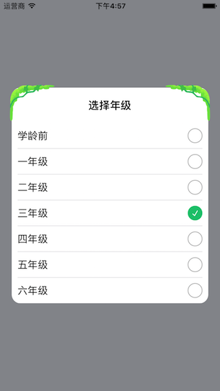

# FFPopListView


## Code Example

``` 
#import "FFPopListView.h"
NSArray *array = @[@"学龄前",@"一年级",@"二年级",@"三年级",@"四年级",@"五年级",@"六年级"];
FFPopListView *popListView = [[FFPopListView alloc] initWithTitle:@"选择年级" dataSource:array selectedText:@"三年级" didSelectBlock:^(FFPopListView *popListView,NSIndexPath *indexPath) {
        NSLog(@"-->%@",array[indexPath.row]);
    }];
    [popListView show];
```

    
## ScreenShot

